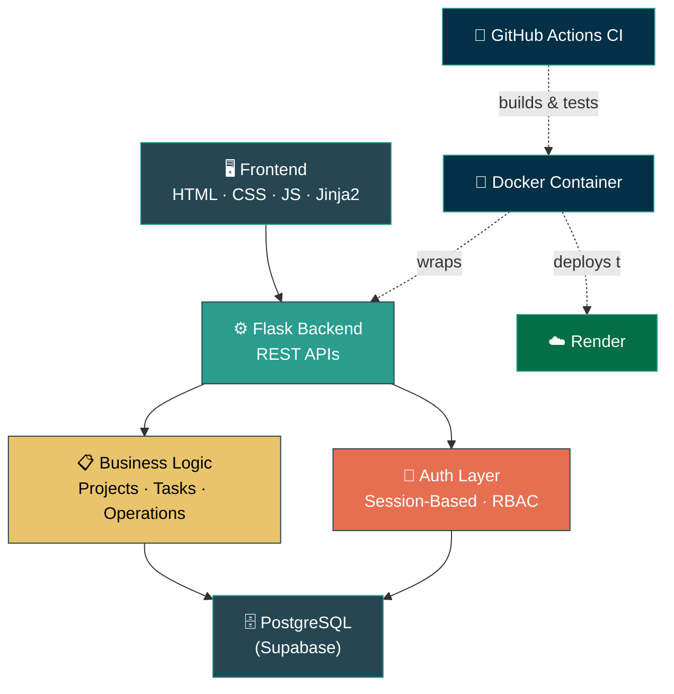
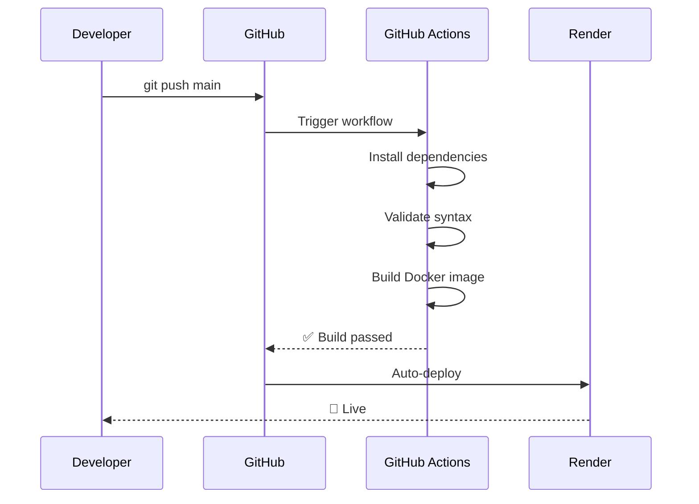

<div align="center">

# 🚀 Project & Operations Management System (POMS)

### A full-stack, role-based platform for managing projects, tasks, and teams — built and shipped end-to-end.

[](https://www.python.org/)
[](https://flask.palletsprojects.com/)
[](https://www.postgresql.org/)
[](https://www.docker.com/)
[](https://github.com/features/actions)
[](https://render.com/)

[](#-license)
[]()
[]()
[]()

**[Live Demo](#)** · **[Report Bug](#)** · **[Request Feature](#)**

</div>

---

## 📖 Overview

**POMS** is a centralized web platform that helps organizations plan projects, assign tasks, manage employees, and track operational issues — without juggling five different tools. It's built around three role-specific dashboards (**Admin**, **Manager**, **Employee**), each designed around what that user actually needs to see and do on a given day.

This isn't a CRUD toy app — it's containerized, has a CI pipeline that runs on every push, and is deployed on real infrastructure (Render + Supabase PostgreSQL). It was built to answer one question: *can a fresher ship something that behaves like production software, not just a notebook?*

---

## 🏗️ System Architecture



**Flow:** Request hits Flask → passes through session-based auth & role check → business logic layer resolves the action → PostgreSQL (Supabase) persists/reads data → role-specific dashboard renders. The whole backend is containerized, and every push to `main` triggers a GitHub Actions pipeline that installs dependencies, validates syntax, and builds the Docker image before it ever reaches Render.

---

## ✨ Features

<table>
<tr>
<td width="33%" valign="top">

### 🔑 Authentication
- Secure login & signup
- Session-based auth
- Forgot password flow
- Role-Based Access Control (RBAC)

</td>
<td width="33%" valign="top">

### 🛡️ Admin Module
- Manage managers & employees
- View all users org-wide
- Revoke user access
- System-wide activity monitoring

</td>
<td width="33%" valign="top">

### 📊 Manager Module
- Create & manage projects
- Assign tasks with deadlines
- Track project progress
- View team performance

</td>
</tr>
<tr>
<td width="33%" valign="top">

### 👤 Employee Module
- View assigned projects
- Update task status
- Report operational issues
- Track personal progress

</td>
<td width="33%" valign="top">

### 📈 Dashboards
- Role-specific views
- Live project statistics
- Task tracking widgets
- Operational monitoring

</td>
<td width="33%" valign="top">

### ⚙️ Infra & DevOps
- Dockerized backend
- CI via GitHub Actions
- Deployed on Render
- Supabase PostgreSQL

</td>
</tr>
</table>

---

## 🛠️ Tech Stack

| Layer | Technology |
|---|---|
| **Frontend** | HTML5, CSS3, JavaScript, Jinja2 Templates |
| **Backend** | Python, Flask, REST APIs |
| **Database** | PostgreSQL (Supabase) |
| **DevOps** | Docker, Git, GitHub Actions (CI), Render |

---

## 👥 User Roles at a Glance

```
┌─────────────┐      ┌─────────────┐      ┌─────────────┐
│    ADMIN    │      │   MANAGER   │      │  EMPLOYEE   │
├─────────────┤      ├─────────────┤      ├─────────────┤
│ Manage all   │      │ Create      │      │ View        │
│ users        │      │ projects    │      │ assigned    │
│              │      │             │      │ work        │
│ Control      │      │ Assign      │      │ Update      │
│ access       │      │ tasks       │      │ status      │
│              │      │             │      │             │
│ Monitor org  │      │ Track       │      │ Report      │
│ activity     │      │ deadlines   │      │ issues      │
└─────────────┘      └─────────────┘      └─────────────┘
```

---

## 🗄️ Database Entities

`Users` · `Projects` · `Tasks` · `Operations` · `Roles`

Normalized relational schema (5+ entities) enforcing referential integrity across role assignments, project ownership, and task status transitions.

---

## 📂 Project Structure

```text
Project-Operations-Manager/
│
├── backend/
│   ├── app.py
│   ├── auth/           # Login, signup, session & RBAC logic
│   ├── database/       # Models & DB connection layer
│   ├── projects/       # Project CRUD & logic
│   ├── tasks/           # Task assignment & tracking
│   └── operations/     # Issue reporting & ops monitoring
│
├── frontend/
│   ├── static/
│   │   ├── css/
│   │   ├── js/
│   │   └── images/
│   └── templates/
│
├── .github/
│   └── workflows/       # CI pipeline definitions
│
├── Dockerfile
├── requirements.txt
├── .env
└── README.md
```

---

## ⚙️ Getting Started

### 1. Clone the repository
```bash
git clone <repository-url>
cd Project-Operations-Manager
```

### 2. Install dependencies
```bash
pip install -r requirements.txt
```

### 3. Configure environment variables
Create a `.env` file in the root directory:
```env
DB_HOST=your_supabase_host
DB_PORT=5432
DB_NAME=postgres
DB_USER=postgres
DB_PASSWORD=your_password
SECRET_KEY=your_secret_key
```

### 4. Run the application
```bash
python backend/app.py
```

Visit **`http://localhost:5000`** 🎉

---

## 🐳 Running with Docker

```bash
# Build the image
docker build -t project-ops-manager .

# Run the container
docker run -p 5000:5000 project-ops-manager
```

---

## 🔄 CI/CD Pipeline

The project runs a fully connected **GitHub Actions** pipeline, actively maintained with daily updates. Every push to `main` automatically triggers a workflow that:

- ✅ Installs all dependencies
- ✅ Validates Python syntax
- ✅ Builds the Docker image
- ✅ Deploys the latest build to Render



---

## ☁️ Deployment

| Component | Service |
|---|---|
| **Application Hosting** | Render |
| **Database** | Supabase PostgreSQL |
| **Containerization** | Docker |
| **Version Control** | Git & GitHub |

---

## 📌 Project Status

<table>
<tr>
<td valign="top" width="50%">

### ✅ Completed
- Landing page
- User authentication
- Role-Based Access Control
- Admin dashboard
- Manager dashboard
- Employee dashboard
- PostgreSQL integration
- Docker integration
- GitHub Actions CI
- Render deployment

</td>
<td valign="top" width="50%">

### 🚧 In Progress
- Project management module
- Task management module
- Operations management module
- Notifications system
- Reports & analytics

</td>
</tr>
</table>

---

## 🔮 Future Enhancements

- 📧 Email notifications
- 📎 File uploads
- 📜 Activity logs
- 📊 Analytics dashboard
- 🤖 AI-based task recommendations
- 🔔 Real-time notifications
- 📅 Calendar integration
- 📱 Mobile-responsive UI

---

## 👨‍💻 Author

**Tanmay Bhole**
B.Sc. Information Technology Student
Passionate about Backend Development, Cloud Computing, DevOps, and Full-Stack Systems.

[](https://linkedin.com/in/tanmaybhole)
[](https://github.com/Tanmay1113)
[](mailto:tanmaybhole001@gmail.com)
